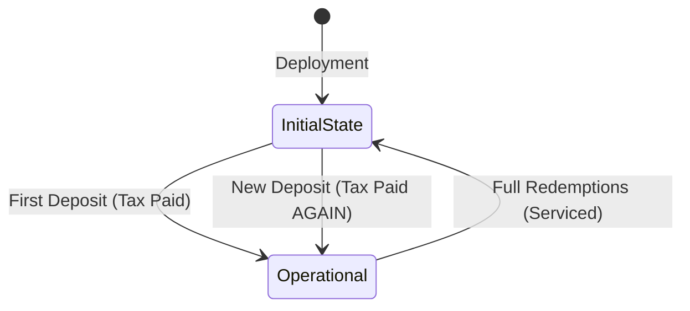

# Technical Deep Dive: The Infinite Tax Vulnerability

## State Machine Analysis
The `StakedUSDai` vault enters the `initialDeposit` state based on a dynamic check:
`bool initialDeposit = totalShares() < LOCKED_SHARES;`

This creates a "circular" state machine:

### Why Redemptions Reset the State
1.  **Request Phase**: A user calls `requestRedeem`. Shares are burned from their balance but added to `_getRedemptionStateStorage().pending`. `totalShares()` remains constant.
2.  **Service Phase**: The admin calls `serviceRedemptions`. Shares are removed from the `pending` queue and `redemptionBalance` is updated.
3.  **Result**: `totalShares()` drops. If the vault has no other users, `totalShares()` drops back to `0`, which is `< 1e6`.

## Mathematical Proof of Leakage
Assume `LOCKED_SHARES = 1e6` (1 USDai with 18 decimals).

1.  **User A** deposits 100 USDai.
    *   `convertToShares(100e18)` returns `99,000,000` (100 - 1).
    *   Vault holds 100 USDai, total shares = 100,000,000 (including 1e6 locked).
2.  **User A** redeems all shares.
    *   Admin services 99,000,000 shares.
    *   `totalShares()` becomes `1,000,000`.
    *   User A receives 99 USDai. 1 USDai is left in the vault but "unclaimed" because no one owns the locked shares.
3.  **User B** deposits 100 USDai.
    *   Since `totalShares() == 1,000,000` is NOT `< 1,000,000`, User B *might* avoid the tax IF they deposit exactly when `totalShares` is `1e6`.
    *   HOWEVER, if the vault was completely empty (0 shares), User B is taxed again.
    *   Even if User B isn't taxed, the previous 1 USDai left by User A is now effectively socialized or lost, as there's no mechanism to claim those specific "locked" assets except through share price appreciation, which is slow.

## Risk Assessment
*   **Likelihood**: High. Any vault that starts with small TVL or experiences full withdrawal cycles will hit this.
*   **Severity**: High. Persistent loss of user funds. Unlike a one-time donation to a vault (which benefits future users), this tax is simply "lost" or re-deducted, creating a continuous drain on entry.
